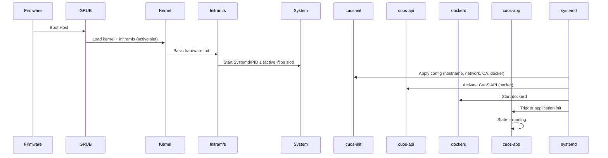
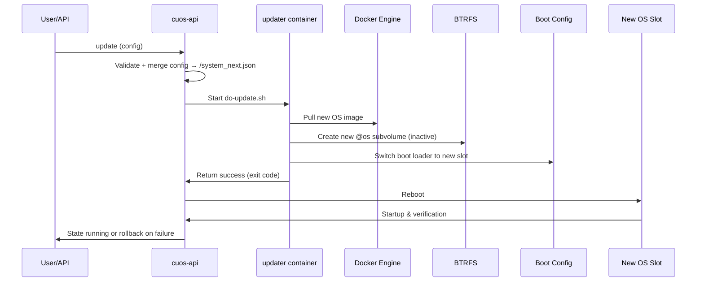

# CuOS Architecture

This document provides a technical overview of CuOS: components, data flows and lifecycle.

Audience: engineers, integrators, DevOps/SRE.

---

## Overview

CuOS defines the operating system as a container image. Updates create new root filesystems (BTRFS subvolumes) and switch atomically via boot configuration.

Core building blocks:

| Layer | Component | Responsibility |
|-------|-----------|----------------|
| Boot | Firmware / GRUB | Load kernel + initramfs, select active root subvolume (@os) |
| Base OS | System image (`os_image`) | Kernel, systemd, CuOS scripts |
| Init | `cuos-init` (script + systemd service) | Apply `system.json` (hostname, network, CA, Docker setup) |
| API Layer | `cuos-api` (`api.sh`, socket) | Commands: update, rollback, patch-*, resources, state |
| App Layer | `cuos-app` (Application Init Container) | Validate & run `initial_image` workload |
| Update Layer | Updater image (`updater_image`) | Prepare new subvolume + boot switch, digest checks |
| Persistence | BTRFS subvolumes `@os`, `@data`, `@swap` | Separate replaceable system from stable data |
| Config files | `/system.json`, `/system_next.json` | Active vs staged (rollback) configuration |
| Status files | `/data/state.json`, `/etc/active_slot` | Runtime state + active slot indicator |

---

## Directory & Path Reference

| Path | Meaning |
|------|---------|
| `/usr/local/cuos/` | CuOS scripts (install, update, API, init) |
| `/etc/image` | Current system image reference |
| `/etc/active_slot` | Logical slot (A/B) |
| `/system.json` | Active configuration |
| `/system_next.json` | Staging / rollback configuration |
| `/data/` | Persistent data (logs, docker, state) |
| `/var/run/cuos.sock` | API socket (single-line JSON protocol) |
| `/data/run-update` | Trigger file for application restart |

---

## Boot Sequence (High-Level)

---

## Update Sequence (OS Switch)

Rollback triggers: application start failures, timeout, integrity problems.

---

## Lifecycle States

| State | Meaning | Transitions |
|-------|---------|-------------|
| `starting` | Boot / startup phase | After reboot / update begin |
| `updating` | Update in progress | Set by `cuos update` + updater script |
| `running` | Normal operation | After successful verification |
| `error` | Fault state / failed startup | May lead to rollback |

The state file is modified by helper functions (see `api.sh`).

---

## A/B Mechanism on BTRFS

Instead of physical A/B partitions CuOS uses two subvolume slots. Advantages:

* Copy-on-write duplicates only changed blocks
* Fast creation of new root filesystem versions
* Rollback via boot configuration switch
* Persistent data (logs, docker layers, app state) stays in `@data`

---

## Configuration Flow

1. Base `system.json` merged with update payload (patch / update)
2. Result stored as `/system_next.json`
3. On update: new slot consumes `/system_next.json` → becomes new `/system.json` after successful boot
4. Rollback: swap files back

In-place patch (`cuos patch*`) modifies `/system.json` directly and keeps previous version at `/system_next.json` for potential rollback.

---

## Security (Brief)

| Area | Recommendation |
|------|----------------|
| Image integrity | Enforce digests for OS, updater, app |
| Registry access | Avoid baking credentials; use secure host secret management |
| Network | Minimal exposed ports, host network only if required |
| Privileges | App container without `--privileged`; granular capabilities |
| CA | Inject custom CA via `custom_ca_certs` & rotate regularly |
| Confinement | AppArmor is on, and dockerd confines the app container with `docker-default` — `docs/common/apparmor.md` |

---

## References

* `system/cuos/api.sh` – API commands
* `system/cuos/app-init.sh` – App container lifecycle
* `image-factory/create_image.sh` – Raw image creation
* `installer-factory/create_iso.sh` – Installer ISO
* `docs/common/btrfs-usage.md` – Subvolume layout
* `docs/common/apparmor.md` – What AppArmor confines, and what it does not
