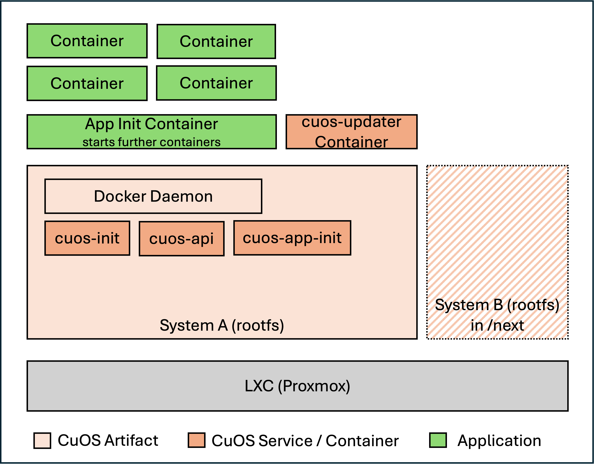

# CuOS in an LXC container

How CuOS in a container differs from a system running on its own disk.

**To build and deploy one**, see
[LXC and Proxmox](https://github.com/cuos-dev/cuos-release/blob/HEAD/docs/lxc-proxmox.md)
in `cuos-release`.

## What is different

An LXC container shares the host's kernel and has no disk of its own, so three
parts of CuOS have no counterpart here:

* **No kernel, initrd or boot configuration.** There is no bootloader step, and
  none of the `install-kernel-*` paths run.
* **No partitions, so no A/B subvolumes.** System swapping happens on
  directories instead.
* **No separate update container.** The update runs inside the system container
  itself.

Everything above that — the configuration model, the API, the application
container, rollback on failure — behaves as it does elsewhere.

## Configuration on first start

A container has no boot partition to read `system.json` from, so it is handed in
as a file instead:

1. CuOS looks for `/system_init.json` inside the container.
2. If it is missing, it **waits** until the file appears.
3. It is copied to `/system.json`, and startup continues.

`system/cuos/init.sh` — `wait_for_lxc_system_init()`.

`tool.sh image --platform lxc` writes the configuration into the image, so a
container built this way finds it and never waits.

## The update process

1. The container pulls the new image version.
2. The update is applied into `/next`.
3. The container restarts.
4. The init process is replaced; it moves `/next` to `/`.
5. On failure it rolls back automatically.

The scripts are in `/usr/local/cuos/` on the running system.
