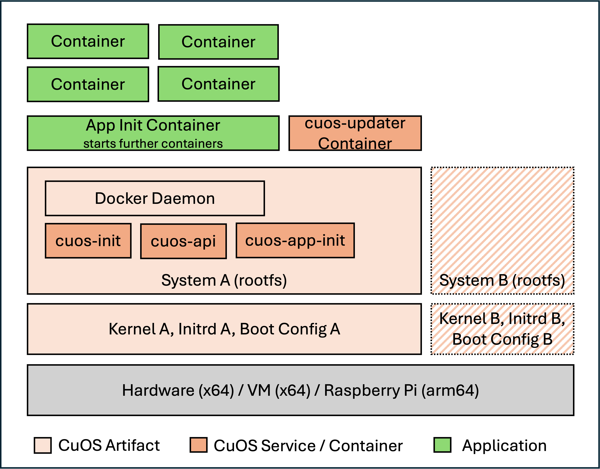

# CuOS Development Guide

CuOS can be taken up at four levels. Each one hands you more of the system and
leaves you less to build; pick the highest one that still gives you what you
need, because everything below it is yours to maintain.

## Which level is yours

| You want to… | Level | Boiler plate |
|---|---|---|
| run services on a ready-made system | [Container Service](#container-service) | [`iac-hello-world-system`](https://github.com/cuos-dev/iac-hello-world-system) |
| implement your own update or deployment mechanism | [Own CuOS Init App](#own-cuos-init-app) | [`boilerplate-own-cuos-init-app`](https://github.com/cuos-dev/boilerplate-own-cuos-init-app) |
| support another board, or ship your own kernel drivers | [Own OS based on the CuOS system](#own-os-based-on-the-cuos-system) | [`boilerplate-own-os-based-on-cuos`](https://github.com/cuos-dev/boilerplate-own-os-based-on-cuos) |
| build an operating system from scratch | [Own OS](#own-os) | none — see the section |

Most readers belong in the first row. The sections below run the other way, from
least CuOS to most, so that each level can say *"above, plus…"* instead of
repeating the one before it.

## Prerequisites

- Docker installed and running
- `jq`
- Access to a container registry, for the levels that publish an image
- Git
- Basic understanding of Docker and of Linux systems

## System layers

CuOS consists of several services and containers.

| Container | Description |
|---|---|
| `cuos-init` | Initialise the system: hostname, network, file system |
| `cuos-api` | API for interaction with the system |
| `cuos-app-init` | Ensure the CuOS Init App is started |
| `cuos-updater` | Helper container to replace/rollback the system, kernel, initrd and boot config. Started by `cuos-api` or your application. |

---

## Own OS

Only needed if you want to do everything from scratch. **Not recommended.**

### Components included

* Image factory
* Updater

### Boiler plate

None. Copy the `Dockerfile` and the `/usr/local/cuos/install-kernel*.sh` scripts
out of this repository — the image factory calls them by name to install the
kernel and write the boot configuration, so your image has to provide them.

---

## Own OS based on the CuOS system

Only needed if you want to support another target, or you need special kernel
drivers.

Be aware that nearly everything can be packed into docker containers — host
services, host network configuration, host firewall configuration, and so on.

Recommended for embedded systems manufacturers building products.

### Components included

Above, plus:

* Boot loader
* Linux kernel and modules
* CPU microcode updates
* Initialisation
  * Network configuration
  * Disk extension
  * Swap management
  * Start of the CuOS Init App
* CuOS API
* Console menu
  * Network check
  * Factory reset
* Software
  * optional SSH for debugging and maintenance (`os_ssh_server`)
  * VM guest tools (x86 only)

### Boiler plate

[`boilerplate-own-os-based-on-cuos`](https://github.com/cuos-dev/boilerplate-own-os-based-on-cuos)
— two Dockerfiles, `system/` and `updater/`, built `FROM` the published CuOS
images. Add your packages and your kernel, keep the rest.

Then point `os_image` (or `<platform>_image`) and `updater_image` in your
`system.json` at what you publish.

---

## Own CuOS Init App

Only needed if you want to implement your own update mechanism or a special way
of deployment.

Recommended for software or embedded systems manufacturers building products.

### Components included

Above, plus:

* IaC deployment
* Automatic update

Optional:

* WebUI
* Fleet management
* dev environment

### Boiler plate

[`boilerplate-own-cuos-init-app`](https://github.com/cuos-dev/boilerplate-own-cuos-init-app)
— an Alpine image whose `dev.cuos.app_command` label already names the mounts a
CuOS Init App needs, plus `cuos_lib.sh` wrapping the API socket (`cuos_ready`,
`cuos_update`).

Then point `init_image` at what you publish. What such a container has to look
like: [Your CuOS Init App](common/cuos-init-app.md).

> **Everything a remote system sends must be protected by signatures.** CuOS IaC
> uses git commit signing and docker digest checks for that; an Init App that
> updates the system has to bring its own equivalent.

---

## Container Service

Here CuOS IaC is the CuOS Init App — the one you get by default, pinned in
`cuos-release`'s `release.json`. You write a `system.json` and a
`docker-compose.yml`, and nothing else.

Recommended for private projects and prototyping.

### Components included

Everything above. Nothing to build.

### Example

[`iac-hello-world-system`](https://github.com/cuos-dev/iac-hello-world-system) —
a complete system in two files. Note what its `system.json` does: `iac_repo_url`
points back at the repository itself, so one repository is both the system
definition and the deployment source.

---

## Building and deploying

The commands live in `cuos-release`, whichever level you are on:

| Task | Guide |
|---|---|
| Disk image | [Building disk images](https://github.com/cuos-dev/cuos-release/blob/main/docs/building-images.md) |
| ISO installer (x86 only) | [Building an installer](https://github.com/cuos-dev/cuos-release/blob/main/docs/building-installers.md) |
| LXC container | [LXC and Proxmox](https://github.com/cuos-dev/cuos-release/blob/main/docs/lxc-proxmox.md) |

What the artefacts contain, and how a system finds its configuration on first
boot, stays here: [What a CuOS image contains](common/building-images.md),
[Installing CuOS](common/installation.md),
[CuOS in an LXC container](common/lxc-deployment.md).

## Reference

- [system.json reference](common/system-json-reference.md) — every key
- [CuOS API](common/cuos-api.md) — what a container can ask the system
- [BTRFS usage](common/btrfs-usage.md) — the A/B subvolumes
- [Platform support](common/platform-support.md) — targets and boot chains
- [Glossary](common/glossary.md) — the terms used here
